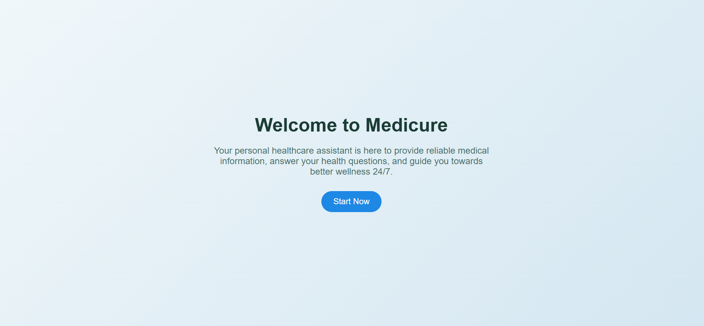
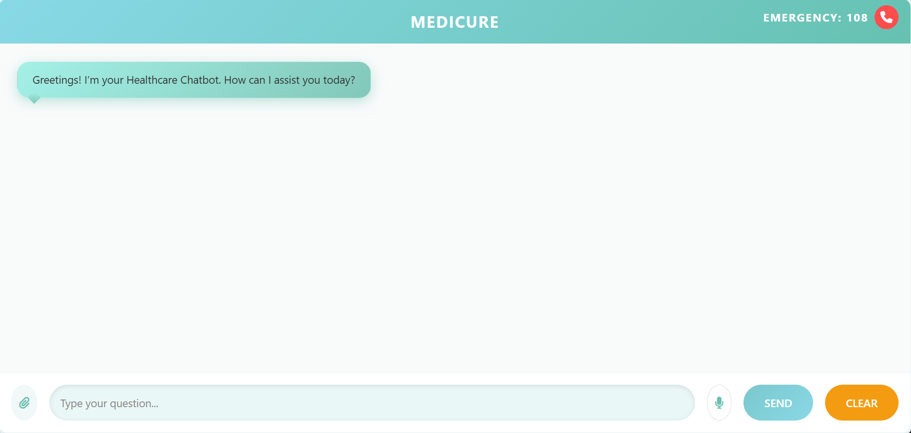
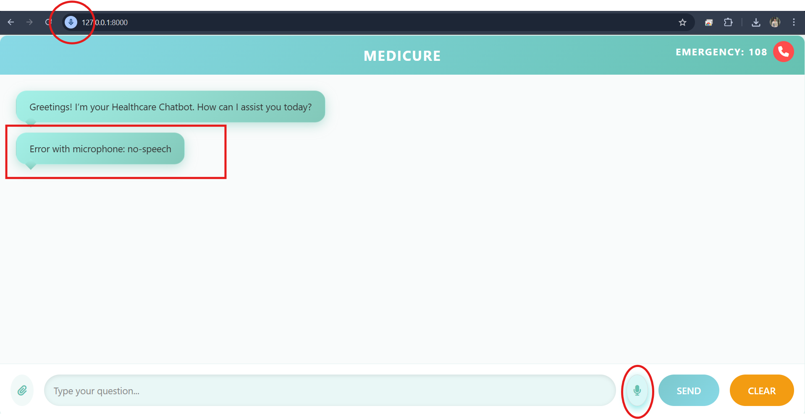
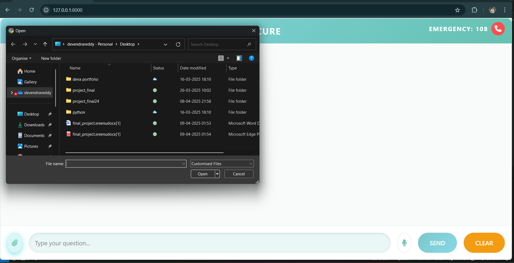
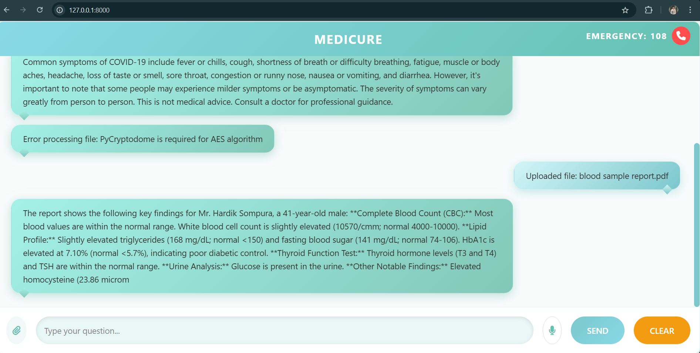

# 🩺 AI Healthcare Chatbot

AI‑Healthcare‑Chatbot is a web‑based intelligent chatbot built using Python and Django. It offers 24/7 medical support, symptom checking, emergency assistance, and general healthcare guidance using Natural Language Processing (NLP). It is designed to improve accessibility, automate patient–chatbot interactions, and enhance digital health experiences.

---

## 📚 Table of Contents

1. [Features](#features)  
2. [Tech Stack](#tech-stack)  
3. [Architecture & Design](#architecture--design)  
4. [Installation & Setup](#installation--setup)  
5. [Usage](#usage)  
6. [Configuration](#configuration)  
7. [API / Endpoints](#api--endpoints)  
8. [Training / Data](#training--data)  
9. [Testing](#testing)  
10. [Deployment](#deployment)  
11. [Future Enhancements](#future-enhancements)  
12. [License](#license)  
13. [Contributing](#contributing)  
14. [Acknowledgments](#acknowledgments)

---

## ✨ Features

- ✅ Symptom checking: users describe symptoms and the chatbot gives likely causes or advice  
- 🚨 Emergency assistance: guidance for urgent medical conditions  
- 💡 Medical guidance & health tips  
- 🌐 24/7 availability via web  
- 🧠 Natural language understanding  
- 💬 Web interface for users to interact with chatbot  
- 📎 File upload and voice input options

---

## 🛠️ Tech Stack

| Layer         | Technology                             |
|--------------|-----------------------------------------|
| Backend       | Python, Django                          |
| NLP / AI      | Keyword Matching (optionally NLTK/spaCy)|
| Database      | SQLite                                  |
| Frontend      | HTML, CSS, JavaScript (Django Templates)|
| APIs / Ext.   | (Optional) Infermedica, Medline, etc.   |

---

## 🧱 Architecture & Design

- **MVC pattern** via Django  
- **Chat Handler Module** to:
  - Parse user input
  - Run NLP logic
  - Generate appropriate chatbot responses
- Data models:
  - Users, Sessions, Medical Knowledge Base, Logs
- Can be extended with:
  - API-based symptom databases (Infermedica, Healthwise)
  - ML model for response generation

```
User → Web UI → Django Views → Chat Handler → NLP Module → Response
```

---

## ⚙️ Installation & Setup

Follow these steps to run the project locally:

```bash
# 1. Clone the repository
git clone https://github.com/devendrareddy2344/AI-Healthcare-Chatbot.git
cd AI-Healthcare-Chatbot

# 2. Create virtual environment
python -m venv venv
source venv/bin/activate   # On Windows: venv\Scripts\activate

# 3. Install dependencies
pip install -r requirements.txt

# 4. Apply migrations
python manage.py makemigrations
python manage.py migrate

# 5. (Optional) Load seed/sample data
# python manage.py loaddata initial_data.json

# 6. Start development server
python manage.py runserver
```

Open [http://127.0.0.1:8000](http://127.0.0.1:8000) in your browser.

---

## ▶️ Usage

Once running:
- Enter symptoms like “I have a headache” or “chest pain” 
- The chatbot will respond with predefined advice  
- Voice and file upload options enhance the experience

---

## 🔧 Configuration

- All chatbot logic is inside:  
  `healthcare_chatbot/views.py`  
- Add/edit keywords and responses in chatbot logic (or link to an API)
- Static assets are in the `/static/` folder  
- HTML templates in `/templates/`

---

## 📡 API / Endpoints

This version does not use REST APIs but you can extend with:

| Route                  | Method | Description                      |
|------------------------|--------|----------------------------------|
| `/`                    | GET    | Landing page                     |
| `/chat/`               | POST   | User sends message to chatbot    |
| `/upload/`             | POST   | Upload medical reports (optional)|
| `/voice/`              | POST   | Capture speech input             |

---

## 📁 Training / Data

Currently uses:
- Rule-based matching from symptom keywords  
- No ML model or data training required  
Future enhancement can integrate:
- Custom intent classification model
- External symptom-checker APIs

---

## ✅ Testing

To test:
```bash
python manage.py test
```

Add unit tests in `healthcare_chatbot/tests.py`

---

## 🚀 Deployment

### Free Deployment Options:
- [Render](https://render.com/)
- [Railway](https://railway.app/)
- [Heroku](https://www.heroku.com/)
- [PythonAnywhere](https://www.pythonanywhere.com/)

These platforms support Django and offer free plans.

---

## 🔮 Future Enhancements

- Integrate external symptom checker APIs (e.g. Infermedica)
- Add a trained ML model for better response generation
- Use spaCy/NLTK for NLP parsing
- User login and chat history
- Deploy with HTTPS and production DB (PostgreSQL)
- Chatbot UI upgrade with React or Vue

---

## 🪪 License

This project is licensed under the MIT License.  
Feel free to use, modify, and share with attribution.

---

## 🤝 Contributing

Contributions are welcome!  

To contribute:
- Fork this repo
- Create a new branch
- Make changes and commit
- Open a pull request

---

## 🙏 Acknowledgments

- Django & Python Community  
- OpenAI (for GPT inspiration)  
- Infermedica API (for future integration)  
- Bootstrap / Tailwind CSS (optional styling)

---

## 📊 Dashboards & Screenshots

### 🏠 Welcome Page
  
**Description**: Intro page that welcomes users to the chatbot. Clear call-to-action to start consultation.

---

### 🏠 Home Page
  
**Description**: Clean layout guiding users to chat. Navigation is simple and beginner-friendly.

---

### 🗣️ Voice Input Feature
  
**Description**: Allows users to speak instead of typing. Helpful for elderly or visually impaired users.

---

### 📄 File Upload – Add Files
  
**Description**: Option to upload reports, prescriptions, or files for context.

---

### 📂 File Upload Confirmation
  
**Description**: Shows that a file was successfully uploaded and received by the system.

---

## 👨‍💻 Author

**Devendra Reddy**  
🔗 [GitHub Profile](https://github.com/devendrareddy2344)

---

## 📁 Repository Structure

```
AI-Healthcare-Chatbot/
├── chatbot-images/           # Project screenshots
├── healthcare_chatbot/       # Django app core
├── static/                   # CSS, JS
├── templates/                # HTML pages
├── db.sqlite3                # SQLite database
├── requirements.txt          # Dependencies
└── manage.py
```

---

> 🎓 Ideal for students, healthcare hackathons, and prototyping real-world AI chatbot solutions.
